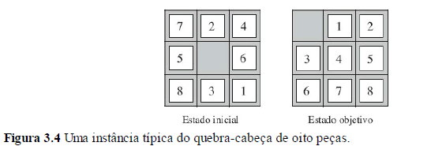

# Resolução de problemas por meio de busca

Algoritmos de busca desempenham um papel fundamental na área de **Inteligência Artificial**, especialmente quando se trata da resolução de problemas baseados em objetivos. Esses algoritmos fornecem uma abordagem sistemática e eficiente para encontrar soluções em um espaço de busca definido. Nesse contexto, exploraremos os algoritmos de busca sem informação, como a busca em largura, a busca em profundidade e a busca em aprofundamento iterativo em grafos.

Esses algoritmos podem ser categorizados como algoritmos de busca sem informação, pois consistem principalmente em duas operações fundamentais. A primeira operação é a geração de estados sucessores a partir de um estado atual, explorando todas as possíveis ações que podem ser tomadas a partir desse estado. A segunda operação é a verificação se o estado gerado corresponde ao estado objetivo, ou seja, se é a solução desejada para o problema em questão. Esses algoritmos se baseiam na exploração sistemática do espaço de busca, expandindo e verificando estados até que uma solução seja encontrada.

## Busca em largura

A busca em largura é um algoritmo simples, porém poderoso, que explora sistematicamente todas as possibilidades a partir de um estado inicial, expandindo gradualmente a busca para estados vizinhos. Esse método garante que todas as soluções possíveis sejam encontradas, embora possa exigir uma quantidade significativa de recursos computacionais em espaços de busca extensos.

## Busca em profundidade limitada
Por outro lado, a busca em profundidade adota uma abordagem mais "profunda" na exploração do espaço de busca, priorizando a exploração de um caminho específico até o limite máximo antes de retroceder. Essa estratégia pode economizar recursos em comparação com a busca em largura, mas pode não encontrar a solução mais ótima, especialmente em espaços de busca com profundidades variáveis.

## Busca de Aprofundamento Iterativo em Profundidade

Para superar as limitações da busca em profundidade e da busca em largura, o algoritmo de busca de aprofundamento iterativo em profundidade combina o melhor dos dois mundos. Ele realiza uma busca em profundidade com limite crescente, ou seja, começa com uma profundidade limitada e aumenta gradualmente o limite até encontrar a solução desejada. Isso permite uma exploração eficiente do espaço de busca, encontrando soluções ótimas em espaços de busca de profundidades desconhecidas.

# Exemplo de problema

O problema do **8 puzzle** é um quebra-cabeça deslizante que envolve um tabuleiro de 3x3 com oito peças numeradas de 1 a 8, além de um espaço vazio. O objetivo é chegar a uma configuração específica do tabuleiro, geralmente representada como o estado final, a partir de uma configuração inicial dada.

O desafio para resolver o problema do 8 puzzle está em encontrar uma sequência de movimentos que leve da configuração inicial à configuração final desejada. No entanto, nem todos os movimentos são permitidos em todas as situações. Por exemplo, uma peça só pode ser movida se houver um espaço vazio adjacente a ela.

O problema do 8 puzzle é considerado um exemplo clássico de um problema de busca e é frequentemente usado como um caso de estudo para algoritmos de busca em Inteligência Artificial. Através da aplicação de algoritmos de busca sem informação, podemos encontrar soluções para esse quebra-cabeça desafiador, analisando o espaço de busca e explorando diferentes caminhos possíveis.

Segue uma possível formulação para o problema:
- **Estados:** Uma descrição de estado especifica a posição de cada uma das oito peças e do
quadrado vazio em um dos nove quadrados.
- **Estado inicial:** Qualquer estado pode ser designado como o estado inicial. Observe que
qualquer objetivo específico pode ser alcançado a partir de exatamente metade dos estados
iniciais possíveis (Exercício 3.4).
- **Ações:** A formulação mais simples define as ações como movimentos do quadrado vazio
*Esquerda, Direita, Para Cima ou Para Baixo*. Pode haver subconjuntos diferentes desses,
dependendo de onde estiver o quadrado vazio.
- **Modelo de transição:** Dado um estado e ação, ele devolve o estado resultante; por exemplo, se
aplicarmos Esquerda para o estado inicial na Figura 3.4, o estado resultante terá comutado o 5 e
o branco.
- **Teste de objetivo:** Verifica se o estado corresponde à configuração de estado objetivo mostrada
na Figura 3.4 (são possíveis outras configurações de objetivos).
- **Custo de caminho:** Cada passo custa 1 e,assim, o custo do caminho é o número de passos do
caminho.

### Referências
*Norvig, P., Russell, S. (2021). Artificial Intelligence: A Modern Approach (3rd ed.). Pearson.*

